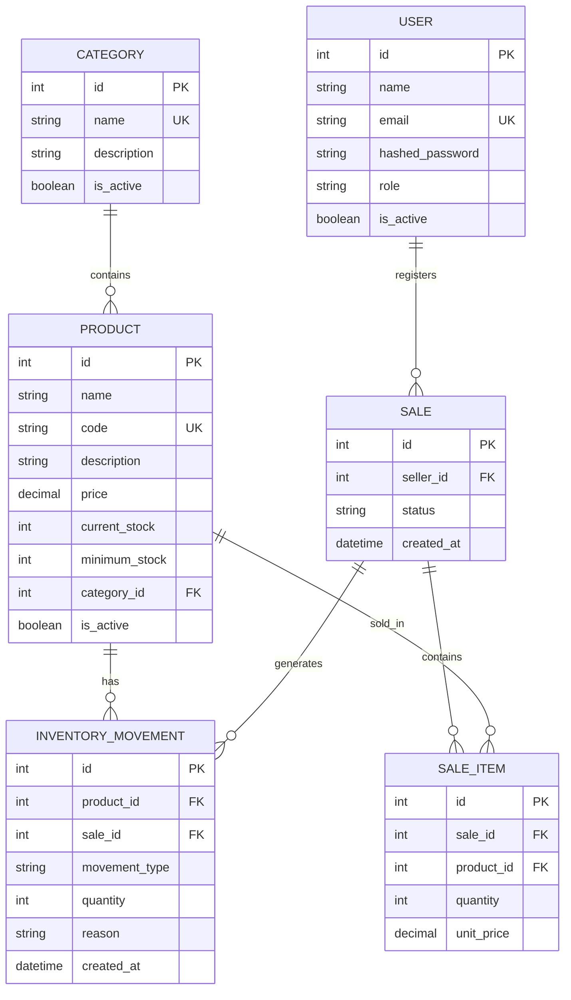

# StockWise - Database ER Diagram

The following Entity-Relationship diagram represents the database structure implemented in StockWise Version 1.0.

## Relationships

- A category can contain multiple products.
- Each product belongs to one category.
- A product can have multiple inventory movements.
- A user can register multiple sales.
- Each sale is associated with the user who registered it through `seller_id`.
- A sale can contain multiple sale items.
- A product can appear in multiple sale items.
- A sale can be associated with multiple inventory movements through `sale_id`.

## Design Notes

- User roles are stored directly in `USER.role`; Version 1.0 does not use a separate roles table.
- Low-stock status is calculated using `current_stock <= minimum_stock`; therefore, Version 1.0 does not require a stock alerts table.
- `INVENTORY_MOVEMENT.sale_id` is optional because not every inventory movement originates from a sale.
- Sale records are preserved when cancelled to maintain historical traceability.
- `SALE_ITEM.unit_price` preserves the price used when the sale was registered.